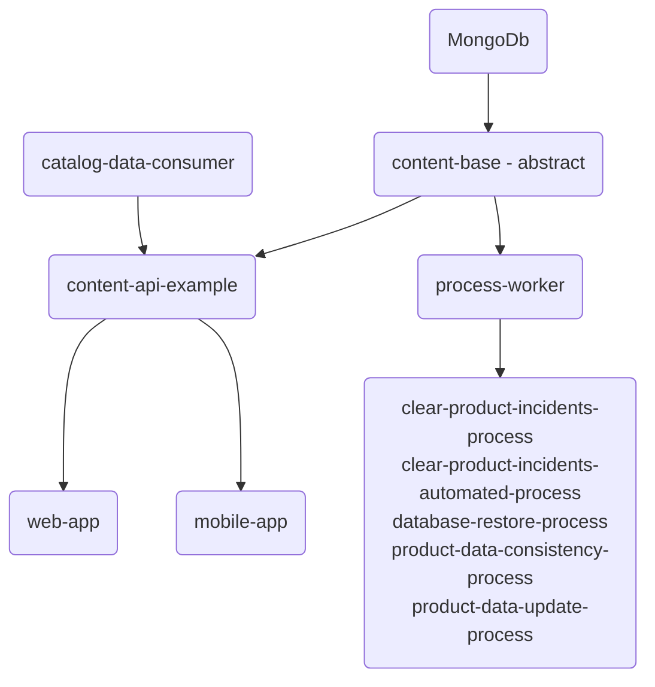

# Prices Crawler - Documentation

This repository contains detailed documentation and diagrams that describe the different components of the system and how they interact.

Prices Crawler system is built on top of MongoDB and comprises several applications that work together to provide a seamless user experience. The [content-base](https://github.com/pricescrawler/content-base) application provides an abstract implementation, which is used by the [content-api-example](https://github.com/pricescrawler/content-api-example). This, in turn, is consumed by the [web-app](https://github.com/pricescrawler/web-app), [mobile-app](https://github.com/pricescrawler/mobile-app), and feed by catalog-data-consumer (implementation not provided).

In addition to these components, it also includes the [process-worker](https://github.com/pricescrawler/process-worker) application, which provides several workflows for ensuring data consistency and performing routine maintenance tasks.

This documentation is intended to provide a comprehensive overview of the system architecture and help developers understand the different components and their interactions. We hope that you find it useful and welcome any feedback or suggestions for improvement.

## 🏗️ System Architecture

This System Architecture is a high-level overview of prices-crawler system that outlines the different components and how they interact with each other. It provides a comprehensive view of the system that is used to guide the development process and ensure that all components are properly integrated.

